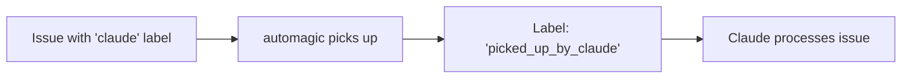
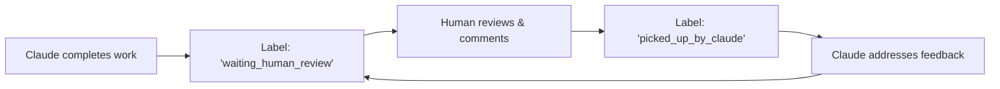

# automagic - Multi-Provider Issue Automation with Claude AI

automagic is a powerful daemon that automates issue processing using Claude AI. It supports both **GitLab** and **GitHub**, monitoring issues with specific labels and automagically creating implementation plans, code changes, and merge/pull requests.

## 🚀 Quick Start

### Installation

Install automagic directly from GitHub using Go:

```bash
go install github.com/bilbo290/automagic@latest
```

### Prerequisites

1. **Go 1.19+** - [Install Go](https://golang.org/doc/install)
2. **Claude CLI** - [Install Claude](https://docs.anthropic.com/en/docs/claude-code)
3. **Provider Account** - GitLab or GitHub account with API access
4. **Personal Access Token** with appropriate permissions

### Required Token Permissions

#### GitLab Personal Access Token
- `api` - Full access to the API
- `read_user` - Read user information  
- `read_repository` - Read repository data
- `write_repository` - Write repository data (for creating branches, commits)

#### GitHub Personal Access Token
- `repo` - Full control of private repositories
- `issues` - Read and write access to issues
- `pull_requests` - Read and write access to pull requests

## 📋 Configuration

### Environment Variables

automagic uses environment variables for all configuration. You can set them directly in your shell or use a `.env` file.

#### Option 1: Direct Environment Variables

**For GitLab:**
```bash
export GITLAB_URL="https://gitlab.com"
export GITLAB_TOKEN="glpat-your-token-here"
export GITLAB_USERNAME="your-gitlab-username"
export CLAUDE_COMMAND="claude"
export CLAUDE_FLAGS="--dangerously-skip-permissions --output-format stream-json --verbose"
```

**For GitHub:**
```bash
export GITHUB_URL="https://api.github.com"
export GITHUB_TOKEN="ghp_your-token-here"
export GITHUB_USERNAME="your-github-username"
export CLAUDE_COMMAND="claude"
export CLAUDE_FLAGS="--dangerously-skip-permissions --output-format stream-json --verbose"
```

**Generic Provider Configuration (Alternative):**
```bash
export PROVIDER_TYPE="github"  # or "gitlab"
export PROVIDER_URL="https://api.github.com"  # or "https://gitlab.com"
export PROVIDER_TOKEN="ghp_your-token-here"
export PROVIDER_USERNAME="your-username"
```

#### Option 2: .env File (Recommended)

Generate a template configuration file:

```bash
automagic -generate-config
```

Then edit the generated `.env` file to configure your preferred provider:

```bash
# automagic Multi-Provider Automation Configuration

# Choose ONE provider approach:

# Option 1: GitHub Configuration (auto-detected)
GITHUB_URL=https://api.github.com
GITHUB_TOKEN=ghp_your-token-here
GITHUB_USERNAME=your-github-username

# Option 2: GitLab Configuration (auto-detected)
# GITLAB_URL=https://gitlab.com
# GITLAB_TOKEN=glpat-your-token-here
# GITLAB_USERNAME=your-gitlab-username

# Option 3: Generic Provider Configuration
# PROVIDER_TYPE=github
# PROVIDER_URL=https://api.github.com
# PROVIDER_TOKEN=ghp_your-token-here
# PROVIDER_USERNAME=your-username

# Claude Configuration
CLAUDE_COMMAND=claude
CLAUDE_FLAGS="--dangerously-skip-permissions --output-format stream-json --verbose"

# Project Configuration (Optional - set via interactive mode)
DEFAULT_PROJECT_PATH=

# Daemon Configuration (Optional)
DAEMON_INTERVAL=10
CLAUDE_LABEL=claude
PROCESS_LABEL=picked_up_by_claude
REVIEW_LABEL=waiting_human_review
```

#### Provider Auto-Detection

automagic automatically detects your provider based on which token is configured:
- If `GITHUB_TOKEN` is set → GitHub provider
- If `GITLAB_TOKEN` is set → GitLab provider  
- `PROVIDER_TYPE` overrides auto-detection

## 🎯 Usage Modes

### Interactive Setup

First, set up your project interactively:

```bash
automagic -interactive
```

This will:
1. List your accessible projects (GitLab or GitHub)
2. Let you select a project to monitor
3. Save the selection to `.env` file
4. Optionally process an issue immediately

### Daemon Mode (Recommended)

#### With Memory (SQLite Session Storage)
```bash
automagic --daemon --memory
```

**Features:**
- Persistent session storage
- automagic session resumption when humans comment
- Full conversation history maintained
- Ideal for complex, ongoing issues

#### Without Memory (Fresh Sessions)
```bash
automagic --daemon
```

**Features:**
- Each issue gets a fresh Claude session
- No session persistence
- Claude reads all existing comments for context
- Simpler architecture, easier debugging
- Repository state preserved between sessions

### Single Issue Processing

```bash
# Process a specific issue
automagic -issue 123

# Dry run (see what would happen)
automagic -issue 123 -dry-run

# Semi-dry run (clone repo, show prompt, but don't execute)
automagic -issue 123 -semi-dry-run
```

### Utility Commands

#### Project Management

```bash
# List organizations/groups you belong to
automagic -list-orgs

# List accessible projects (with interactive organization selection)
automagic -list-projects

# Filter projects by keyword
automagic -list-projects -keyword "backend"

# Filter projects by visibility
automagic -list-projects -visibility "public"

# Combine filters
automagic -list-projects -keyword "api" -visibility "private"

# Search for projects by name (simple search)
automagic -search "backend"
```

#### Issue Management

```bash
# List issues in selected project
automagic -list-issues

# List issues with specific label
automagic -list-issues -label "claude"

# Test label filtering functionality
automagic -test-labels
```

#### Debugging and Development

```bash
# Debug provider MCP integration (GitLab/GitHub)
automagic -debug-mcp
```

### 🔍 Enhanced Project Listing

automagic provides powerful project discovery and filtering capabilities for both GitHub and GitLab:

#### Interactive Organization Selection

When you run `automagic -list-projects`, you'll get an interactive prompt to select organizations:

```
Select organizations to include (or press Enter for all):
0. [Personal] your-username (your personal repositories)
1. [Org] company-org (Company Organization)
2. [Org] open-source-org (Open Source Projects)
3. All organizations

Enter organization numbers separated by commas (e.g., 0,1,3) or 'all':
```

**Selection Options:**
- **Single numbers**: `0` (personal only), `1` (specific org)
- **Multiple selections**: `0,1,3` (personal + two orgs)
- **All organizations**: Press Enter or type `all`
- **Flexible input**: Comma-separated, spaces ignored

#### Advanced Filtering

**Keyword Filtering** - Searches across:
- Repository/project name
- Full path (owner/repo)
- Description text

```bash
# Find all projects related to "api"
automagic -list-projects -keyword "api"

# Case-insensitive search
automagic -list-projects -keyword "BACKEND"
```

**Visibility Filtering:**
```bash
# Show only public repositories
automagic -list-projects -visibility "public"

# Show only private repositories  
automagic -list-projects -visibility "private"

# GitLab also supports "internal"
automagic -list-projects -visibility "internal"
```

**Combined Filtering:**
```bash
# Find public APIs
automagic -list-projects -keyword "api" -visibility "public"

# Private backend services
automagic -list-projects -keyword "backend" -visibility "private"
```

#### Provider-Specific Features

**GitHub:**
- Fetches repositories from personal account and all organizations
- Supports private/public repository filtering
- Includes repository descriptions and last activity dates
- Handles organization membership automatically

**GitLab:**
- Fetches projects from accessible groups and personal namespace
- Supports public/private/internal project filtering
- Group-based filtering using project path prefixes
- Compatible with self-hosted GitLab instances

#### Output Format

Results show comprehensive project information:
```
=== Project Listing Results ===
Organizations: your-username, company-org
Keyword filter: api
Visibility filter: public

Found 12 projects:

Name: backend-api
Path: company-org/backend-api
Description: REST API for the main application
Visibility: public
URL: https://github.com/company-org/backend-api
Last Activity: 2025-07-13T15:30:22Z
```

## 🏷️ Label Workflow

automagic uses a three-label workflow system:

### 1. Starting Work: `claude` Label



**To start:** Add the `claude` label to any GitLab issue or GitHub issue.

### 2. Processing: `picked_up_by_claude` Label

While automagic is processing:
- Issue is labeled `picked_up_by_claude`
- Claude analyzes the issue and existing comments
- Creates implementation plan and posts as comment
- Implements the solution
- Creates merge request (GitLab) or pull request (GitHub)
- Updates issue with completion status

### 3. Human Review: `waiting_human_review` Label



After Claude completes:
- Issue is labeled `waiting_human_review`
- Humans review the merge/pull request and implementation
- Add comments with feedback, questions, or requests
- automagic automagically detects human comments and re-engages Claude

### 4. Completion: `solved` Label

When satisfied with the implementation:
- Manually change label to `solved`
- Or remove all workflow labels
- This stops the automation loop

## 🔧 Advanced Configuration

### Custom Claude Flags

Set custom Claude flags in your environment:

```bash
export CLAUDE_FLAGS="--dangerously-skip-permissions --output-format stream-json --verbose --model claude-3-5-sonnet-20241022"
```

### Different Polling Intervals

```bash
export DAEMON_INTERVAL=30  # Check every 30 seconds instead of 10
```

### Custom Label Names

```bash
export CLAUDE_LABEL="ai-help"          # Instead of "claude"
export PROCESS_LABEL="ai-working"      # Instead of "picked_up_by_claude" 
export REVIEW_LABEL="human-review"     # Instead of "waiting_human_review"
```

## 📁 Project Structure

```
your-project/
├── .env               # Configuration file (environment variables)
└── .git/              # Git repository (will be auto-cloned if needed)
```

## 🐛 Troubleshooting

### Common Issues

**1. "Provider connection test failed"**
```bash
# Check your token and URL configuration
automagic -list-projects

# List organizations to verify access
automagic -list-orgs
```

**2. "No project configured"**
```bash
# Run interactive setup
automagic -interactive
```

**3. "Claude command not found"**
```bash
# Install Claude CLI
# See: https://docs.anthropic.com/en/docs/claude-code
which claude
```

**4. "Permission denied" errors**

For **GitLab**:
- Check GitLab token permissions
- Ensure token has `api` and `write_repository` scopes

For **GitHub**:
- Check GitHub token permissions  
- Ensure token has `repo`, `issues`, and `pull_requests` scopes

### Debug Mode

Use dry-run modes to debug issues:

```bash
# See exactly what would happen
automagic --daemon -dry-run

# Clone repo and show prompts without executing
automagic --daemon -semi-dry-run
```

### Logs and Monitoring

automagic provides detailed logging:

```bash
# Run daemon with full debug output
automagic --daemon 2>&1 | tee automagic.log
```

## 🔄 Workflow Examples

### Example 1: New Feature Request

1. **Human creates issue**: "Add dark mode toggle to settings page"
2. **Human adds label**: `claude`
3. **automagic picks up**: Changes label to `picked_up_by_claude`
4. **Claude analyzes**: Reads issue description and existing comments
5. **Claude plans**: Posts implementation plan as comment
6. **Claude implements**: Creates branch, writes code, commits changes
7. **Claude delivers**: Creates merge request (GitLab) or pull request (GitHub), updates issue
8. **System updates**: Label changes to `waiting_human_review`
9. **Human reviews**: Checks MR/PR, tests locally, adds feedback comment
10. **automagic re-engages**: Detects human comment, changes label back to `picked_up_by_claude`
11. **Claude iterates**: Addresses feedback, updates implementation
12. **Loop continues**: Until human is satisfied and marks as `solved`

### Example 2: Bug Fix

1. **Issue**: "Login form doesn't validate email addresses properly"
2. **Add label**: `claude`
3. **Claude**: Investigates code, identifies validation logic issue
4. **Claude**: Posts analysis and fix plan as comment
5. **Claude**: Implements fix, adds tests, creates MR/PR
6. **Human**: Reviews, requests additional test cases
7. **Claude**: Adds more comprehensive tests
8. **Human**: Approves and merges, marks `solved`

## 🚀 Best Practices

### Issue Description Quality

Write clear, detailed issue descriptions:

```markdown
## Problem
The user login form accepts invalid email addresses like "user@" or "user.com"

## Expected Behavior
Only valid email addresses should be accepted (user@domain.com format)

## Acceptance Criteria
- [ ] Email validation follows RFC 5322 standard
- [ ] Clear error messages for invalid emails
- [ ] Unit tests cover edge cases
- [ ] Integration tests verify form behavior
```

### Effective Human Feedback

When reviewing Claude's work:

```markdown
## Code Review Feedback

✅ **Good:**
- Implementation logic is correct
- Tests cover main scenarios

🔄 **Needs Changes:**
- Please add validation for edge case: empty domain
- Error message should be more user-friendly
- Add test for maximum email length (320 chars)

## Questions
- Should we support internationalized domain names?
- What about plus addressing (user+tag@domain.com)?
```

### Repository Management

- Keep your repositories clean and up-to-date
- Use meaningful branch names (automagic creates `issue-{number}` branches)
- Review and merge automagic's MRs/PRs promptly to avoid conflicts

## 🔒 Security Considerations

- Store access tokens securely (use environment variables in production)
- Review all code changes before merging
- Use appropriate repository permissions (GitLab project permissions or GitHub repository permissions)
- Consider running automagic in a isolated environment for production use

## 📚 Additional Resources

- [Claude Code Documentation](https://docs.anthropic.com/en/docs/claude-code)
- [GitLab API Documentation](https://docs.gitlab.com/ee/api/)
- [GitHub API Documentation](https://docs.github.com/en/rest)
- [automagic GitHub Repository](https://github.com/bilbo290/automagic)

## 🤝 Contributing

Contributions are welcome! Please see [CONTRIBUTING.md](CONTRIBUTING.md) for guidelines.

## 📄 License

This project is licensed under the MIT License - see the [LICENSE](LICENSE) file for details.